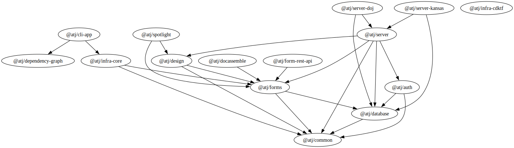

# 10x Access to Justice Tooling

Test bed for ATJ platform tooling, completed as part of the [10x Digital Access to Justice Platform](https://trello.com/c/25Jl6NwJ/207-digital-access-to-justice-platform) project.

## Overview

The project dependencies within the workspace are:



Additional documentation:

- [Architectural Decision Records (ADRs)](./documents/adr/)
- [Release process](./documents/release-process.md)

## Overview

The platform is made up of the following high-level terms.

### Key personas

- Content authors: legal experts who craft guided interview experiences via a "no code" interface
- Self-represented litigants (SREs): end-users who interact with the court via guided interviews created by content authors

### Things

- **Blueprint**: produced by a content author, the blueprint defines the structure of an interactive session between a court and an SRL
- **Conversation**: one instance of a blueprint; the interactive session between a court and an SRL. Other terms for this concept include dialogue or session.
- **Pattern**: the building blocks of a blueprint, patterns implement UX best-practices, defining the content and behavior of the user interface.
- **Prompt**: produced by a pattern, the prompt defines what is presented to the end user at single point in a conversation.
- **Component**: user interface component that acts as the building block of prompts.

## Development

This project uses [pnpm workspaces](https://pnpm.io/workspaces). To work with this project, [install pnpm](https://pnpm.io/installation) and then the project dependencies:

```bash
pnpm install
```

To run the complete test suite, with coverage metrics generated:

```bash
pnpm test
```

To run tests in watch mode (except the `infra` tests, which use Jest):

```bash
pnpm vitest
```

To start developing with hot reloading, use:

```bash
pnpm build
```
then run:

```bash
pnpm dev
```

These local servers will be started:

- Astro website - http://localhost:4321/
- Storybook - http://localhost:61610/

To lint the source code:

```bash
pnpm lint
```

## Command-line interface

A command-line interface is provided for manually running operations. The corresponding app resides in [./apps/cli](./apps/cli). A wrapper script, in the root directory, is provided.

```bash
./manage.sh --help
```

## End-to-end testing
E2E testing runs in a docker container. 

```bash
docker build --tag 'playwright' . -f Dockerfile.e2e
```

You can add the `--no-cache` flag to build from scratch.

To run the container: 

```bash
docker run -p 80:80 -it --rm playwright
```

