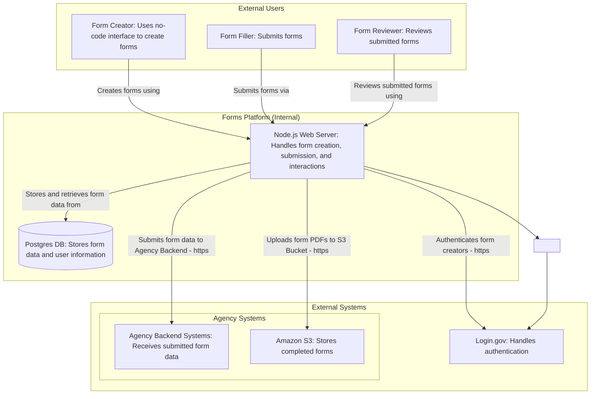

# Forms Platform - architecture diagram

```mermaid
flowchart TB
    subgraph "External Users"
        formFiller[Form Filler: Submits forms]
        formCreator[Form Creator: Uses no-code interface to create forms]
        formReviewer[Form Reviewer: Reviews submitted forms]
    end

    subgraph "Forms Platform (Internal)"
        webServer[Node.js Web Server: Handles form creation, submission, and interactions]
        database[(Postgres DB: Stores form data and user information)]
    end

    subgraph "External Systems"
        loginGov[Login.gov: Handles authentication]

        subgraph "Agency Systems"
            agencyBackend[Agency Backend Systems: Receives submitted form data]
            s3Bucket[Amazon S3: Stores completed forms]
        end
    end

    formCreator -->|Creates forms using| webServer
    formFiller -->|Submits forms via| webServer
    formReviewer -->|Reviews submitted forms using| webServer
    webServer -->|Stores and retrieves form data from| database

    webServer -->|Authenticates form creators - https| loginGov
    webServer -->|Submits form data to Agency Backend - https| agencyBackend
    webServer -->|Uploads form PDFs to S3 Bucket - https| s3Bucket

    %% Forcing "External Systems" to be below "Forms Platform"
    dummyNode[ ]:::invisible
    webServer --> dummyNode
    dummyNode --> loginGov
```
