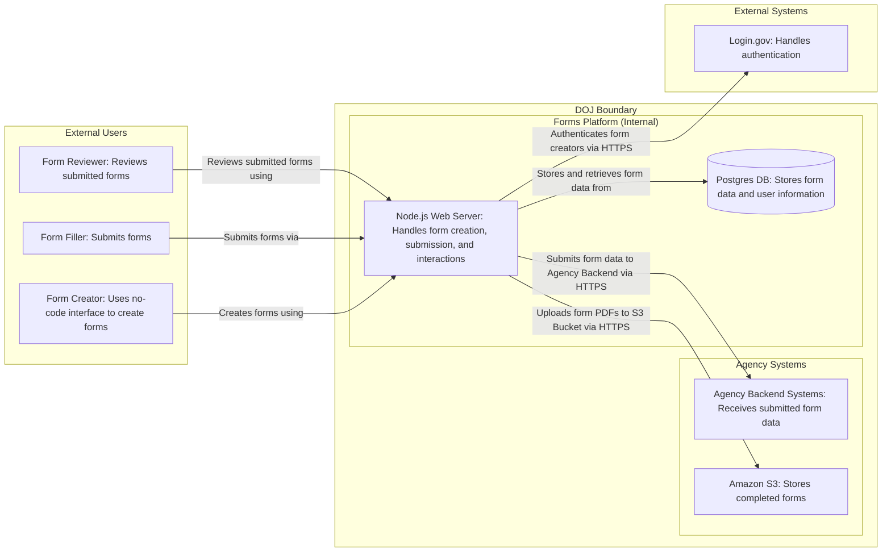

# Forms Platform - DOJ architecture diagram

Sample diagram of a potential DOJ deployment of the Forms Platform.

```mermaid
flowchart LR
    subgraph "External Users"
        formFiller[Form Filler: Submits forms]
        formCreator[Form Creator: Uses no-code interface to create forms]
        formReviewer[Form Reviewer: Reviews submitted forms]
    end

    subgraph "DOJ Boundary"
        subgraph "Agency Systems"
            direction TB
            agencyBackend[Agency Backend Systems: Receives submitted form data]
            s3Bucket[Amazon S3: Stores completed forms]
        end

        subgraph "Forms Platform (Internal)"
            webServer[Node.js Web Server: Handles form creation, submission, and interactions]
            database[(Postgres DB: Stores form data and user information)]
        end
    end

    subgraph "External Systems"
        loginGov[Login.gov: Handles authentication]
    end

    formCreator -->|Creates forms using| webServer
    formFiller -->|Submits forms via| webServer
    formReviewer -->|Reviews submitted forms using| webServer
    webServer -->|Stores and retrieves form data from| database

    webServer -->|Authenticates form creators via HTTPS| loginGov
    webServer -->|Submits form data to Agency Backend via HTTPS| agencyBackend
    webServer -->|Uploads form PDFs to S3 Bucket via HTTPS| s3Bucket
```
